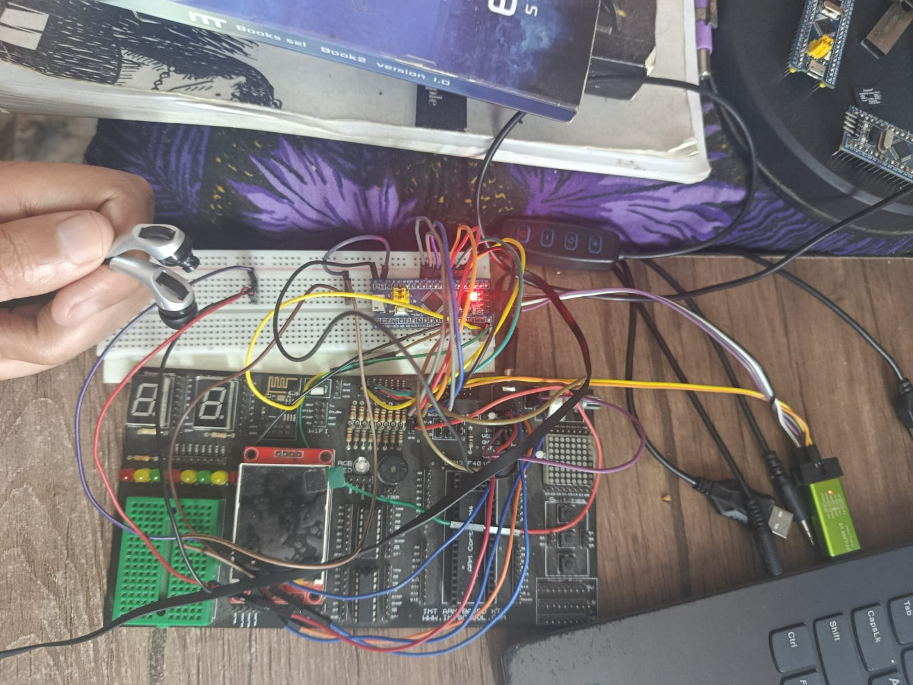

# Wake_DAC
# 🎵 R-2R DAC Audio Alert System for Luxury Cars

This project demonstrates the use of an **R-2R DAC (Digital to Analog Converter)** using GPIO Port A of an STM32 microcontroller to output a pre-recorded **"Wake Up"** voice message through a speaker. The main use case is for **driver alertness** in luxury vehicles – to wake up fainted or sleepy drivers.

---

## 🚗 Project Overview

- **Target Audience**: Automotive systems for luxury vehicles
- **Purpose**: Alert drivers with an audible "Wake Up" sound if drowsiness or fainting is detected
- **Platform**: STM32 microcontroller
- **Audio Output**: "Wake Up" voice message using R-2R DAC technique

---

## 🔊 What Is a DAC?

A **Digital-to-Analog Converter (DAC)** converts digital values (like 8-bit numbers) into a continuous analog voltage. In this project, we implemented a **resistor-ladder R-2R DAC**, which is a cost-effective and simple way to create an analog signal using GPIO pins and resistors.

### Why R-2R?

- **Simple design**
- **No external DAC IC required**
- **Easily integrated into embedded systems**

The DAC output is then:
- Smoothed via a **potentiometer**
- Amplified
- Sent to a **headphone or speaker**

---

## 🌍 Why This Project Matters

Drowsiness or sudden fainting while driving is a critical safety hazard. In luxury cars, having an **automated, non-intrusive alert system** that plays a familiar and clear sound like “Wake Up” could save lives.

- 🛡️ **Driver Safety**  
- 🚘 **Luxury car personalization**
- 🔉 **No dependency on external modules**

---

## 🛠️ Hardware Setup

Here’s a picture of the real hardware running the project:



**Components in the setup:**

- STM32F103C8T6 "Blue Pill" microcontroller
- Breadboard with R-2R resistor ladder connected to Port A (PA0–PA7)
- Potentiometer (to control voltage before amplifier)
- Audio amplifier module
- Earphones for output
- ST-Link programmer
- Display and debug components for additional features

---

## 🧠 Software Tools Used

- **Audacity** – For audio processing and conversion to 8-bit raw format
- **Terminal + xxd** – To convert `.raw` audio to C header file (`wake.h`)
- **Bare-metal STM32 drivers** – For GPIO, RCC, and SysTick

---

## 🧾 How It Works

1. The `"Wake Up"` sound is sampled and stored in `wake_raw[]` array.
2. A SysTick timer periodically sends each byte to GPIOA (PA0–PA7).
3. R-2R ladder converts digital output into analog voltage.
4. Potentiometer adjusts output level before amplification.
5. Amplified audio is played through headphones.

---

## 🧪 Code Snapshot

```c
volatile u16 i;

void voidSetDAC(void)
{
	GPIOA_ODR = wake_raw[i];
	i++;
	if (i == 6649)
		i = 0;
}
